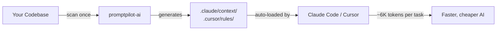

<div align="center">

# promptpilot-ai

### AI context layer for your codebase

**Works with Claude Code · Cursor · Both**

[](https://www.npmjs.com/package/promptpilot-ai)
[](./LICENSE)
[](https://nodejs.org)

</div>


<div align="center">

> Scan your project once → AI understands everything → no more blind file hunting

</div>

---

## The Pitch

Every AI coding task starts the same way: Claude or Cursor reads 8–12 files to "understand" your project before writing useful code. That's **~25,000 tokens spent on context-hunting**, every single task.

`promptpilot-ai` scans your codebase **once** and writes structured markdown context files that Claude Code and Cursor read automatically.

| | Without promptpilot-ai | With promptpilot-ai |
|---|---|---|
| File reads per task | 8–12 | 2–3 |
| Tokens per task | ~25,000 | ~6,000 |
| Savings | — | **70% fewer tokens** |
| Multi-repo cross-lookup | Manual, many reads | Auto via `bridge.md` |

---

## Quick Start

```bash
npx promptpilot-ai@latest init
```

Pick your AI tool and you're done:

```
? Which AI tool are you using?
  ❯ Claude Code
    Cursor
    Both
```

Open your project in Claude Code or Cursor — context loads automatically.


---

## How It Works



1. **Scan** — walks your project, detects stack, modules, naming patterns
2. **Generate** — writes structured markdown context files (architecture, stack, patterns, per-module)
3. **AI reads** — Claude Code / Cursor auto-load context before any task

---

## What Gets Generated

<details>
<summary><strong>For Claude Code</strong></summary>

```
your-project/
├── AGENTS.md                        ← cross-tool standard + MANDATORY rules + Project rules
├── CLAUDE.md                        ← context index (auto-loaded by Claude)
├── .claude/
│   ├── settings.json                ← permissions + optional status bar
│   ├── pp-statusline.mjs            ← status bar script (if opted in)
│   ├── commands/
│   │   ├── ask.md                   ← /ask slash command
│   │   ├── plan.md                  ← /plan slash command
│   │   ├── sync.md                  ← /sync slash command
│   │   ├── pp-stats.md              ← /pp-stats slash command
│   │   └── pp-help.md               ← /pp-help slash command
│   ├── context/
│   │   ├── architecture.md          ← project structure
│   │   ├── stack.md                 ← tech stack & commands
│   │   ├── patterns.md              ← naming & code conventions
│   │   └── modules/
│   │       ├── auth.md
│   │       ├── components.md
│   │       └── ...
│   ├── skills/                      ← project-aware skills (opt in)
│   │   ├── design/SKILL.md
│   │   ├── devops/SKILL.md          ← + reference.md (Dockerfile, CI)
│   │   ├── db/SKILL.md
│   │   └── ship/SKILL.md            ← /ship pipeline orchestrator
│   └── agents/                      ← multi-agent pipeline (opt in)
│       ├── planner.md
│       ├── builder.md
│       └── tester.md
└── .git/hooks/post-commit           ← auto-sync on commit
```

</details>

<details>
<summary><strong>For Cursor</strong></summary>

```
your-project/
└── .cursor/
    └── rules/
        ├── architecture.mdc         ← always loaded (alwaysApply: true)
        ├── stack.mdc                ← always loaded
        ├── patterns.mdc             ← always loaded
        └── modules/
            ├── auth.mdc             ← loaded when you open auth files
            ├── components.mdc       ← loaded when you open component files
            └── ...
```

Cursor's `.mdc` rules use `alwaysApply: true` for global context and file-glob matching for module-level context — so you only pay for what's relevant.

</details>

---

## AGENTS.md + Mandatory Standards

promptpilot-ai also generates a root **`AGENTS.md`** — the cross-tool standard read natively by Claude Code, Codex, Cursor, Copilot, Gemini CLI, Aider, Windsurf, Zed and more. One file → every tool understands your project.

It bakes in **mandatory engineering standards**, adapted to your detected stack:

- **Always** — no duplicate code, use common functions/components, pass the linter (TS strict / PEP 8 / PSR-12 per language), match conventions, never hardcode secrets.
- **Backend** (if detected) — API performance (no N+1, paginate, index hot columns), reuse the service layer, validate every input, parameterize SQL.
- **Frontend** (if detected) — UI consistency (reuse components, one styling system), no duplicate UI, accessibility, responsive.

These same standards are injected into `CLAUDE.md` and `.claude/context/patterns.md` / `.cursor/rules/patterns.mdc`, so **every tool enforces them**.

### Self-updating rules

`AGENTS.md` has two zones:

```
<!-- promptpilot-ai:start -->   ← AUTO: refreshed from your code on every `sync`
   ...stack, commands, mandatory standards...
<!-- promptpilot-ai:end -->
## Project rules (developer-maintained)   ← PERSISTS across syncs
- Use Zod for all API input validation.
- All money values stored as integer cents.
```

When you (or the AI) establish a new convention, preference, or requirement, it's appended under **Project rules** — that section is **never overwritten** by `sync`, so the rules accumulate and every future AI session inherits them.

---

## Multi-Repo Workspace (Frontend + Backend)

```
your-workspace/        ← run init here
  backend/             ← NestJS / Express
  frontend/            ← Next.js / React
```

```bash
cd your-workspace
npx promptpilot-ai@latest init
```

promptpilot-ai auto-detects both repos and generates a **bridge map**:

```markdown
## Endpoint Map

| Method | Path        | Frontend File               | Backend File                    | Handler   |
|--------|-------------|-----------------------------|---------------------------------|-----------|
| GET    | /users      | src/app/users/page.tsx      | src/users/users.controller.ts   | findAll() |
| POST   | /auth/login | src/app/auth/login/page.tsx | src/auth/auth.controller.ts     | login()   |
```

Now when you say `/ask add a user profile page`, AI reads `bridge.md`, finds the matching endpoint, and implements **both** frontend and backend in one pass.

---

## Commands

### CLI

| Command | Description |
|---|---|
| `npx promptpilot-ai init` | First-time setup — scan project and generate context |
| `npx promptpilot-ai sync` | Re-scan after major restructuring or new modules |
| `npx promptpilot-ai sync --templates` | Also refresh `.claude/commands/*.md` slash command templates (use after a promptpilot-ai upgrade) |
| `npx promptpilot-ai stats` | Show a context dashboard — files scanned, context size (KB + tokens), modules, last sync, stale files |
| `npx promptpilot-ai help` | Full command reference — every CLI + slash command with its use-case |

### Claude Code Slash Commands (after init)

| Command | Description |
|---|---|
| `/ask <request>` | Natural language → plan → execute (cross-repo aware) |
| `/plan <request>` | **Interactive planning** — detects UI vs backend, shows 2–3 layout approaches as ASCII mockups for you to pick, then delivers the final plan with reusable-component reuse enforced |
| `/sync` | Trigger a context sync from inside Claude Code |
| `/pp-stats` | Show the context dashboard (files, size, modules, staleness) inside Claude Code |
| `/pp-help` | List every command (CLI + slash) and its use-case inside Claude Code |

> All slash commands respond in the same language you write your request in (English, Hindi, Hinglish, Spanish, etc.). Code, paths, and identifiers stay in English.

### Status bar (Claude Code)

Opt in during `init` and promptpilot-ai adds a live status line at the bottom of Claude Code:

```
📊 PP 18KB · 142 files · 7 mod · synced 2h ago  │  ctx 35% (71k/200k) 🟢  │  opus
```

- **Left** — your generated context (size, files, modules, last sync) read instantly from a cache, no rescan.
- **Middle** — live context-window usage straight from Claude Code (green → yellow → red as it fills).
- It never overrides a `statusLine` you already configured. Refreshed on `npx promptpilot-ai sync --templates`.

### Context dashboard

Run `/pp-stats` inside Claude Code (or `npx promptpilot-ai stats` in your terminal) for a full breakdown:

```
╭──────────────────────────────────────────────╮
│  promptpilot-ai · context                      │
│  ────────────────────────────────────────      │
│  Files scanned     142                         │
│  Context size      ~18.4 KB  (~4.7k tokens)    │
│  Modules           7                           │
│  Last sync         2h ago                      │
│  Stale             3 files (auth, billing)     │
│                                                │
│  components  ██████████   28 files   5.2 KB    │
│  auth        ████░░░░░░   12 files   3.1 KB    │
│  lib         ███░░░░░░░   14 files   2.1 KB    │
╰──────────────────────────────────────────────╯
```

> **Stale** counts uncommitted source files that fall inside scanned modules — a quick hint that it's time to `sync`.

---

## Project-Aware Skills

Opt in during `init` and promptpilot-ai generates **skills** pre-filled with your stack and conventions — so the AI inherits them instead of re-deriving them every task. Each is auto-invoked when relevant (or call it with `/name`), and is only generated when it applies to your stack.

| Skill | What it does | Knows (auto-detected) |
|---|---|---|
| `design` | Build UI the project's way — enforces existing-component reuse | UI library (shadcn / MUI / Livewire / Inertia), CSS approach (Tailwind…), components module, naming |
| `devops` | Stack-aware Dockerfile, GitHub Actions CI, deploy config (bundles a ready-to-adapt `reference.md`) | package manager, build / test / lint commands, runtime, existing Docker / CI files |
| `db` | Models, migrations, queries the right way | ORM (Prisma / Drizzle / Eloquent / Django ORM / SQLAlchemy…), database, migrate command, models module |

- **Claude Code** → `.claude/skills/<name>/SKILL.md` (auto-discovered; first run asks for workspace trust).
- **Cursor** → equivalent `.cursor/rules/<name>.mdc`, glob-scoped so they apply only to relevant files.
- Refreshed automatically on every `npx promptpilot-ai sync`.

---

## Multi-Agent Pipeline (`/ship`)

Opt in during `init` and promptpilot-ai generates three project-aware subagents plus a `/ship` orchestrator (Claude Code):

```
/ship add a user profile page

  planner  → reads .claude/context/ + bridge.md, returns a step-by-step plan
  builder  → implements from the plan, reusing components via the design/db skills
             (frontend + backend builders run in PARALLEL for multi-repo work)
  tester   → writes tests with your detected framework, runs them, reports
```

- The subagents don't share live memory — they **share the generated `.claude/context/` and skills**, and the orchestrator relays each stage's result to the next. That shared context is exactly what promptpilot-ai produces, so the agents stay consistent without re-explaining the stack.
- **Parallel where it's safe:** independent frontend/backend work runs concurrently; the plan→build→test chain stays ordered.
- Claude Code only — subagent orchestration has no equivalent Cursor rule. (Cursor's `/multitask` is the closest manual alternative.)

| Agent | Role | Knows (auto-detected) |
|---|---|---|
| `planner` | Step-by-step plan, no code | architecture, modules, bridge map |
| `builder` | Implement from the plan | conventions, reusable components (via `design` / `db` skills) |
| `tester` | Write + run tests | test framework, test + lint commands |

---

## Mobile (React Native · Flutter · Android · iOS)

promptpilot-ai detects and generates context for **mobile** apps too — so AI inherits your mobile stack and conventions instead of guessing.

| Platform | Detected from | What it learns |
|---|---|---|
| **React Native / Expo** | `package.json` | navigation, state, persistence (AsyncStorage / MMKV / WatermelonDB), NativeWind / Tamagui / Paper |
| **Flutter** | `pubspec.yaml` | Riverpod / BLoC / Provider / GetX, Drift / Hive / Isar, go_router, Material / Cupertino |
| **Native Android** | `build.gradle(.kts)` | Kotlin / Java, Jetpack Compose vs XML, Hilt, Room, Retrofit, Navigation |
| **Native iOS** | `Package.swift` / `Podfile` | Swift, SwiftUI vs UIKit, CoreData / SwiftData / Realm, SPM / CocoaPods |

**Mandatory standards are platform-aware** (baked into AGENTS.md / CLAUDE.md / patterns):

- **Performance** — virtualize long lists (FlatList · ListView.builder · LazyColumn · List), avoid needless re-renders / rebuilds, never block the UI / main thread, target 60fps.
- **UI consistency** — reuse the design-system components / widgets, one styling approach, Material 3 / Apple HIG, accessibility (TalkBack / VoiceOver), responsive.
- **State & data** — the detected state manager + persistence + offline / loading / error states.

**`/mobile` skill** — run & test on an emulator / simulator, write **Maestro** E2E flows, capture & review screenshots, read logs, and build / release — with the exact commands for your platform.

> iOS simulator testing needs macOS + Xcode; Android needs the SDK + an AVD. promptpilot-ai generates the commands — the SDKs/emulators must be installed on the machine.

---

## Supported Stacks

| Category | Supported |
|---|---|
| **Frontend** | Next.js (App + Pages Router), React (Vite), Vue, Svelte, Astro, Remix |
| **Backend (Node)** | NestJS, Express, Fastify, Hono, Koa |
| **Backend (PHP)** | Laravel, Lumen, Symfony |
| **Backend (Python)** | Django, Django REST Framework, FastAPI, Flask |
| **Mobile** | React Native, Expo, Flutter, native Android (Kotlin/Java), native iOS (Swift) |
| **Languages** | TypeScript, JavaScript, PHP, Python, Dart, Kotlin, Java, Swift |
| **Databases** | PostgreSQL, MySQL, MongoDB, SQLite |
| **Mobile storage** | AsyncStorage, MMKV, WatermelonDB, Realm, expo-sqlite · Drift, Hive, Isar, sqflite · Room, DataStore, SQLDelight · CoreData, SwiftData, GRDB |
| **ORMs** | Prisma, Drizzle, TypeORM, Eloquent, Django ORM, SQLAlchemy, SQLModel, Tortoise |
| **Package Managers** | pnpm, npm, yarn · Composer · pip, Poetry, Pipenv, uv · pub (Dart) · Gradle · SPM, CocoaPods |
| **Testing** | Vitest, Jest · PHPUnit, Pest · pytest, unittest · flutter_test · JUnit · XCTest · Maestro, Detox (E2E) |

> **Cross-language bridge:** a JS/TS frontend (Next.js/React) paired with a Laravel or Python backend is auto-detected in multi-repo workspaces — `bridge.md` maps frontend `fetch`/`axios` calls to Laravel `Route::` / FastAPI / Flask / Django endpoints.

---

## Keeping Context Fresh

| Trigger | What happens |
|---|---|
| `git commit` | Post-commit hook auto-updates changed modules |
| New module or endpoint | Run `npx promptpilot-ai sync` manually |
| Major refactor | Run `npx promptpilot-ai sync` manually |
| promptpilot-ai upgrade | Run `npx promptpilot-ai sync --templates` to refresh slash commands |

promptpilot-ai checks npm for new versions once a day (throttled, opt-out via `NO_UPDATE_NOTIFIER=1` or `CI=1`) and surfaces updates in your terminal, inside Claude Code via `SessionStart`, and in Cursor via an auto-generated `.cursor/rules/_promptpilot-update.mdc`.

---

## FAQ

**Do I need an API key?**
No. Uses your existing Claude Code plan or Cursor subscription — no extra API keys.

**Does it work without git?**
Yes. Without `.git`, the filesystem is walked directly (skipping `node_modules`, `dist`, `.next`, etc.).

**Can I use it with both Claude and Cursor?**
Yes — select "Both" during init. It generates `.claude/` and `.cursor/rules/` simultaneously.

**Is it safe to commit the generated files?**
Yes, commit them. Teammates get context immediately without running init themselves.

**How do I turn the status bar on or off?**
It's opt-in — `init` asks before enabling it. To turn it off later, remove the `statusLine` block from `.claude/settings.json` (and optionally delete `.claude/pp-statusline.mjs`). To turn it on, run `npx promptpilot-ai init` again, or add the `statusLine` block manually pointing at `node .claude/pp-statusline.mjs`.

---

## License

MIT
